## Hardware

With core board, dock board, and a PMOD-LEDx8:


## Create Project

Open Gowin FPGA Designer, click New Project to build a FPGA Design Project, choose project name and directory.

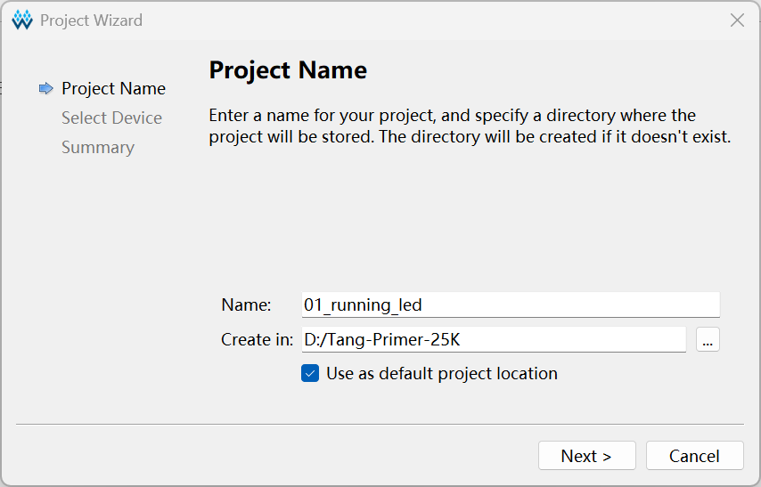

Select device `GW5A-LV25MG121NC1/I0`. (If using Gowin Education, perhaps `GW5A-LV25MG121NES`)

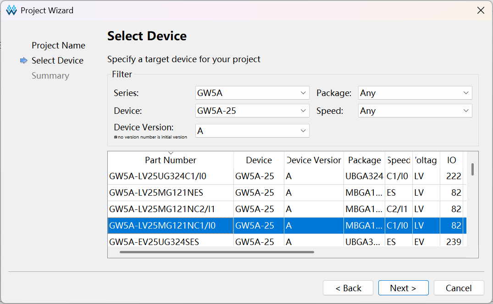


## Create Verilog File

In the left design window, right click to create new verilog file.

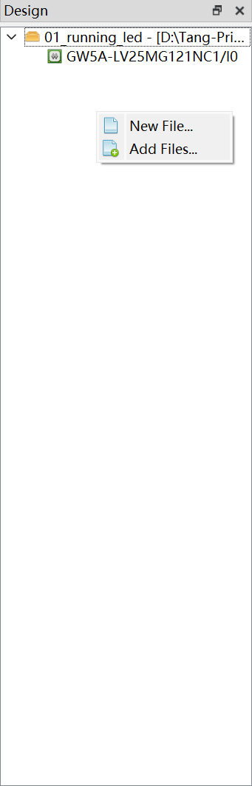

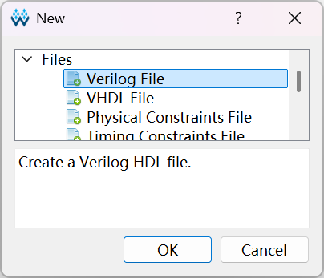

Set a proper file name, and check `Add to current project`.

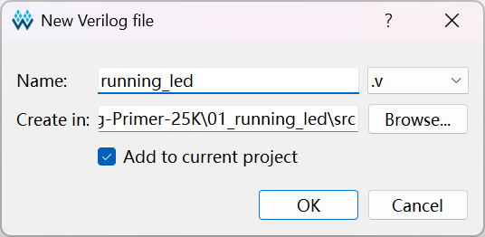


## RTL code

In verilog file, input:

```verilog
module RunningLED
(
    input clk,          // 50M Hz clock
    input rst,          // Reset from button
    output [7:0] oLED   // Output for 8-bit LEDs
);

localparam COUNTER_MAX = 32'd9_999_999;

reg [32:0] counter = 32'b0;
reg [7:0] rLED = 8'b1111_1110;

always @ (posedge clk or posedge rst) begin
    if (rst) begin
        rLED <= 8'b1111_1110;
        counter <= counter + 1'b1;
    end else begin
        if ( counter <= COUNTER_MAX ) begin
            counter <= counter + 1'b1;
        end else begin
            counter <= 32'b0;
            rLED <= {rLED[6:0], rLED[7]};
        end
    end
end

assign oLED = rLED;

endmodule
```


## Synthesize

Select `process` window.


Double click `Synthesize` or right-click it to run.

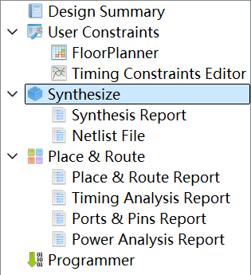


## Add Physical Constraints

Double click `FloorPlanner` to create a `.cst` file.

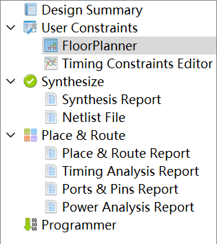

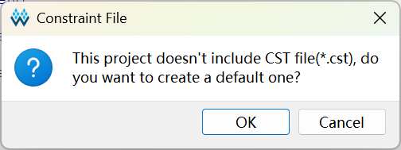

In the FloorPlanner window, select `IO Constraints`.

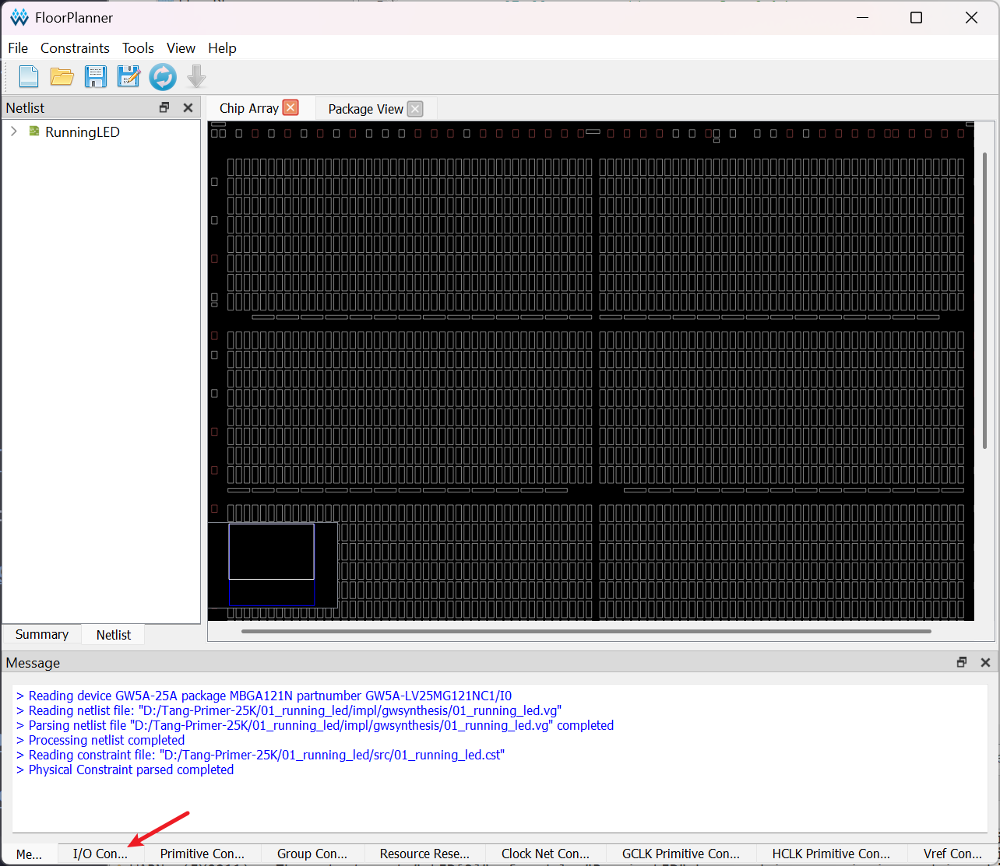

In this case, we set pins for IO as below, and the pull mode of `rst` is `DOWN` because `rst` is active high.

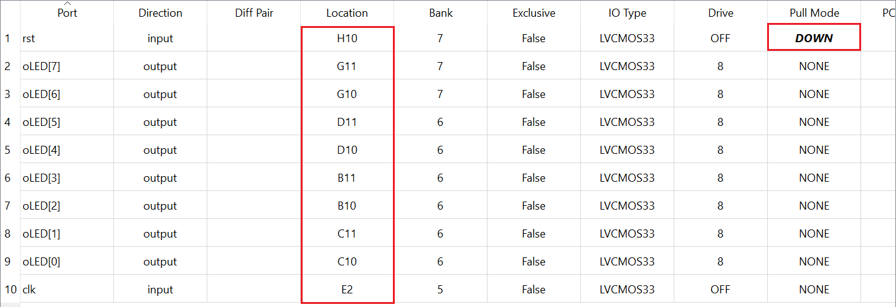

Then `ctrl+s` to save it, and just close the window.


## Add Timing Constraints

Double click `Timing Constraints Editor` to create a `.sdc` file

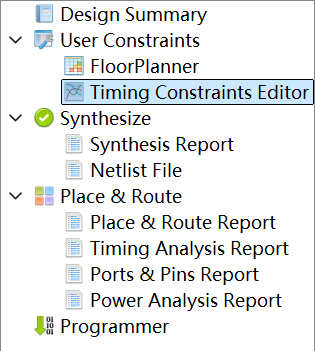

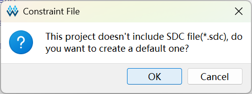

Create a clock.

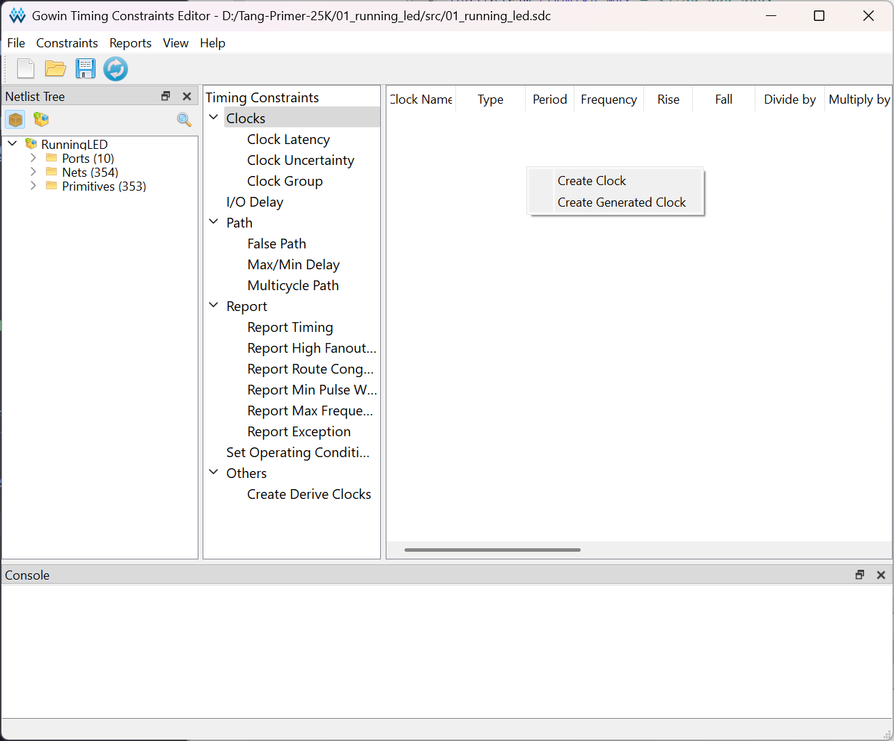

Set its name and frequency.

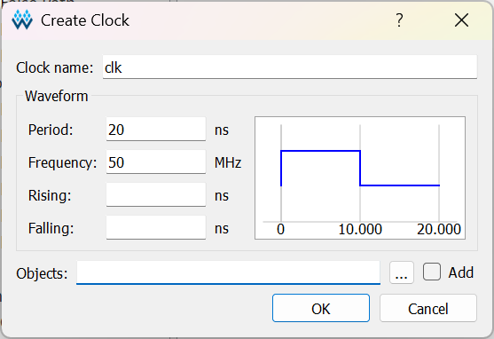

Click the `...` box right to `Objects`.

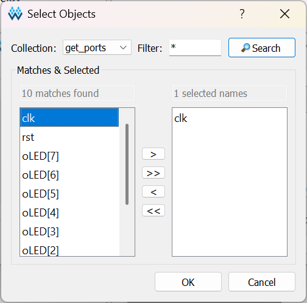

Click OK and `ctrl+s` to save, then close the window.

Now we have `.v`, `.cst` and `.sdc` files.

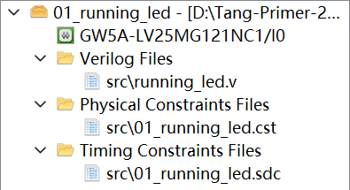


## Place & Route

Right-click `Place & Route` and open configuration. In `Dual-Purpose Pin`, check `Use CPU as regular IO`.

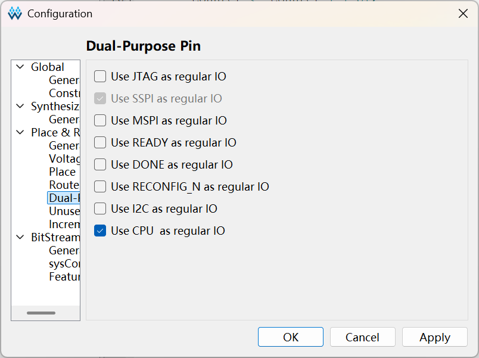

Then click OK. Double click `Place & Route` to run.

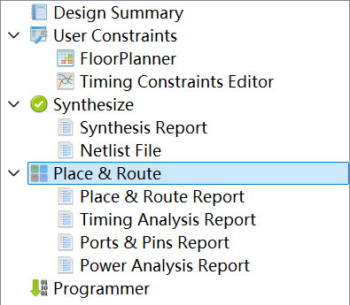

If no error occurs, it is ready to program the FPGA.


## Program

Double click `Programmer`.

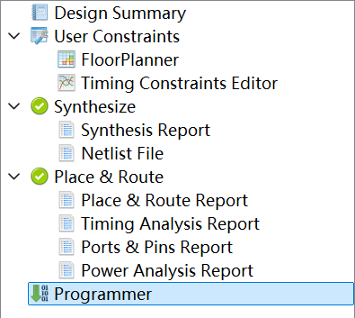

Wait it to scan the device, then program it.

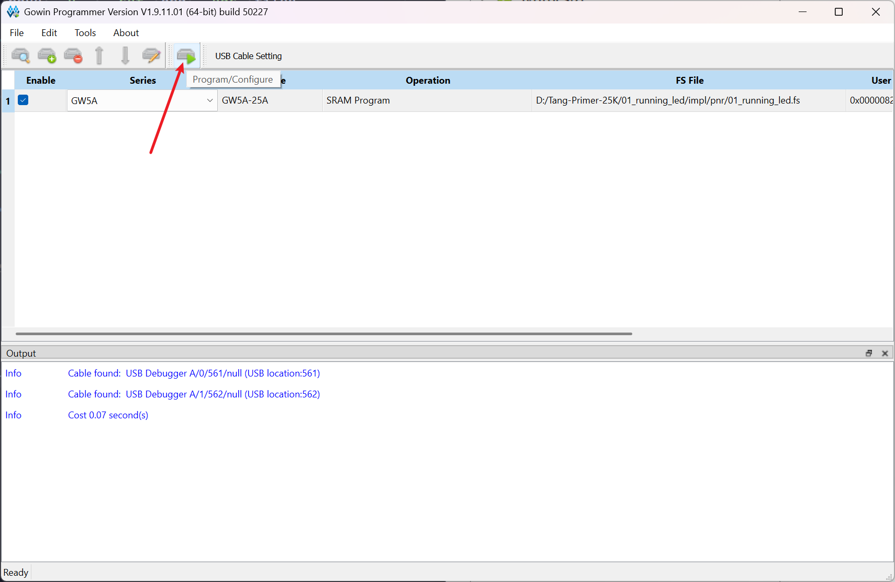

Then you will see the running LED!


You can press the button `S2` (with pin `H10`) to reset it.
 